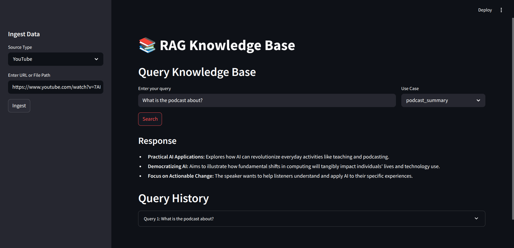

# RAG Knowledge Base: AI-Powered Content Summarization


This project is a **Retrieval-Augmented Generation (RAG)** system designed to ingest, process, and summarize content from diverse sources, including YouTube videos, web articles, and PDFs.

Built as a **learning project**, it explores:
- Natural Language Processing (NLP)
- Vector databases
- Large Language Models (LLMs)

The system demonstrates the ability to extract meaningful insights from **unstructured data** and generate **concise summaries** using the **Gemini API**, with a particular focus on **podcast-style YouTube videos**.

> ⚙️ **Technology Stack**: Python, LangChain, Qdrant, Sentence Transformers, BeautifulSoup, pdfplumber, Gemini API, Docker

---

## ✅ What I Have Done

### 1. Data Ingestion Pipeline
- **Supported Sources**: YouTube transcripts, web articles, PDFs
- **Implementation**:
  - `youtube-transcript-api` for extracting YouTube transcripts
  - `BeautifulSoup` for scraping web articles
  - `pdfplumber` for PDF text extraction
- **Architecture**: 
  - Abstract `KnowledgeBase` class
  - Specific extractors: `YouTubeExtractor`, `ArticleExtractor`, `PDFExtractor` in `get_knowledge.py`
- **Storage**: Extracted text saved to `data/`, organized by source type (e.g., `data/youtube_data/`)

---

### 2. Text Processing & Chunking
- **Chunking**: Uses `RecursiveCharacterTextSplitter` from LangChain
  - Chunk size: `384`
  - Overlap: `20`
- **Deduplication**: MD5 hashing to remove duplicates (`utils.py`)

---

### 3. Vector Store & Embeddings
- **Vector DB**: Qdrant (`vectorstore.py`)
- **Embeddings**: `sentence-transformers/all-MiniLM-L6-v2` (`embedding.py`)
- **Features**:
  - Deduplicates before adding to Qdrant
  - Similarity search using cosine distance

---

### 4. LLM Integration
- **Model**: Google Gemini API (`gemini-2.0-flash`)
- **Prompt Templates** (`constants.py`):
  - `podcast_summary`
  - `science_explainer`
  - `code_analysis`
- **Workflow**: 
  1. Similarity search retrieves relevant chunks
  2. Formats input and sends to Gemini for summarization

---

### 5. Configuration & Utilities
- **Config Management**: `config.py`, `constants.py`
- **Utilities**: Document loading, output formatting, hashing (`utils.py`)

---

### 6. Dockerized Qdrant
- **Current Setup**: Uses `qdrant/qdrant` Docker image (non-persistent storage)
- **Integration**: Runs on `localhost:6333`

---

##  Technologies Used

| Category       | Tools Used                                                |
|----------------|-----------------------------------------------------------|
| **Languages**  | Python                                                    |
| **Frameworks** | LangChain, Sentence Transformers                          |
| **Databases**  | Qdrant (Vector DB)                                        |
| **Web Parsing**| BeautifulSoup, pdfplumber, youtube-transcript-api        |
| **LLM**        | Google Gemini API                                         |
| **Container**  | Docker                                                    |

---
##  What I Am Going to Do and How You Can Contribute

### 1. Improve Model Response Quality
- Add batch ingestion for multiple sources
- Refine prompt templates for sparse/noisy context
- Upgrade to `all-mpnet-base-v2` for better embeddings
- Optimize chunking size to `1000` with overlap of `100`
- Explore more advanced models 

---

### 2. Enhance Similarity Search
- Add metadata (e.g., timestamp, video ID)
- Implement hybrid search (Vector + BM25)
- Add **First-Principles Questioning** to prompt deeper insights

---


### 4. Dockerize the Full Application
- **Dockerfile**: Full app + dependencies
- **Docker Compose**: Manages both app and Qdrant
- **Deployment**: Push image to Docker Hub

---


### 6. Testing & Documentation
- Add **unit tests** with `pytest`
- Expand README with:
  - Setup instructions
  - Usage examples
  - Architecture diagram
- Add docstrings across modules

---

## 🛠️ Setup Instructions (Current)

```bash
# 1. Clone the Repository
git clone https://github.com/Vinay-kanuku/end-to-end-RAG.git
cd end-to-end-RAG

# 2. Install Dependencies
pip install -r requirements.txt

# 3. Set Up Environment
echo "API_KEY=your-gemini-api-key" > .env

# 4. Start Qdrant (No persistence)
docker run -d -p 6333:6333 qdrant/qdrant

streamlit run app.py
 
